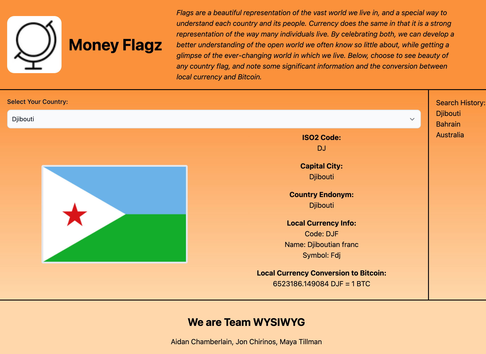

# project - Team WYSIWYG

## Description

Money Flagz accepts a user input, makes API calls, and then displays the relevant data fetched from the APIs. Money Flagz calls the Country Flags API, returning the chosen flag as a .png file. Money Flagz calls the CountryStateCity API, returning an array of data about the chosen country. Money Flagz calls the Free Currency Rates API, returning the exchange value of chosen currency to Bitcoin. Money Flagz uses Tailwind CSS to provide a steamlined user interface. Money Flagz updates displayed information with each user input, overwriting the previous information and saving a search history.

## Technologies Used

-   HTML
-   Javascript
-   Tailwind CSS
-   Country Flags API
-   CountryStateCity API
-   Free Currency Rates API

## Screenshot

## Links to Application

-   Here is the repo: [TeamWYSIWYG/project](https://github.com/Team-WYSIWYG/project)
-   Here is the pages: [TeamWYSIWYG project Pages](https://team-wysiwyg.github.io/project/)
